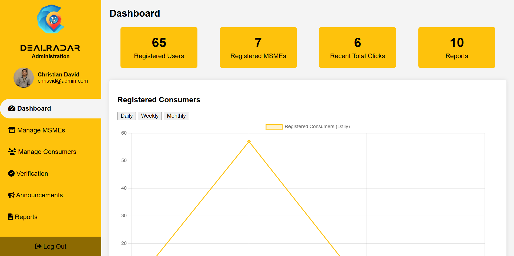
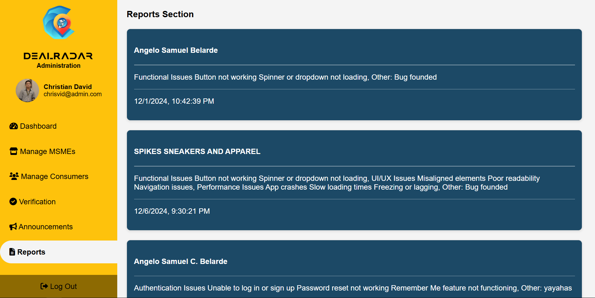

# DealRadar-Casptone-Project

This repository showcases the **Admin Website** component of my Capstone Project:

**“DealRadar: Location-Driven Mobile Application for Sales Promotion and Offers of Selected Micro, Small and Medium Enterprises (MSMEs) in Naga City”**

⚠️ **Note:** This repository contains **screenshots only** — no source code — due to project circumstances.  

---

## 📸 Screenshots

| Screenshot | Description |
|------------|-------------|
|  | **Dashboard** — Overview of analytics with graphs and charts summarizing MSME activities and promotions |
|  | **Manage MSMEs** — Review of registered enterprises, including store information, location, and business permit validation |
|  | **Promotion Verification** — Checking legitimacy of submitted sales promotions based on permit numbers, dates, and terms |
|  | **Consumer Management** — Admin section for monitoring and managing consumer accounts and activity |
|  | **Announcements** — Admin can post announcements with text, images, and videos which appear on the consumer mobile application home page |
|  | **Reports** — Detailed insights and reports on MSME registrations, promotions, and consumer engagement |

---

## 📌 Features

- **Analytics Dashboard**
  - View charts and insights related to MSMEs and promotions.
- **MSME Registration Review**
  - MSMEs that register via the mobile application are placed **under review**.  
  - Admin verifies legitimacy by checking uploaded business permits.  
  - Admin can **accept or reject** the registration.
- **Sales Promotion Validation**
  - Before promotions go live, Admin checks permit number, dates, and validity.  
  - Admin can **accept or reject** promotions based on legitimacy.  
- **User Management**
  - Manage which users have access to the Admin Website.  
- **Role of the Admin**
  - Responsible for **Read, Update, and Delete only** (no Create, since MSMEs submit data via the MSME Mobile App).  
  - Ensures security and integrity of the system.

---

## 🛠 Tools & Technologies Used

- **Frontend**
  - HTML  
  - CSS  
  - JavaScript  

- **Backend & Database**
  - Firebase Firestore  

- **Deployment**
  - Firebase Hosting  

- **Collaboration & Version Control**
  - Git & GitHub  

---

## 📂 Repository Contents
- `screenshots/` — Project screenshots with sensitive information blurred.  
- `README.md` — Project description and showcase (this file).  

---

## 📄 Research Context
This Admin Website was developed as the **critical backend system** of DealRadar.  
It ensures that only verified MSMEs and legitimate promotions are displayed in the mobile applications used by businesses and consumers in Naga City.  

The mobile applications (MSME & Consumer apps) were developed by my teammates.  
I was solely responsible for the **Admin Website** component.

---

## 🔗 Live Demo Link
[View Admin Website]((https://dealradar-consumer.web.app/))
